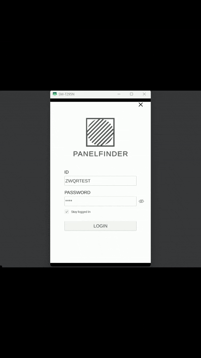

\# PanelFinder

Unity 기반 BIM Viewer 프로젝트입니다.

\##  Overview

PanelFinder는 IFC(Building Information Modeling) 파일을 GLB 형식으로 변환하고,

Android 환경에서 최적화된 3D BIM 모델을 확인할 수 있도록 개발한 프로젝트입니다.

\##  Features

\- IFC → GLB 변환

&#x20; 

\- Android BIM Viewer

\- GLTFast 기반 모델 로딩

\- 모델 회전 / 이동 / 확대

\- QR 코드 기반 파일 로딩

\- 렌더링 최적화

\##  Tech Stack

\- Unity

\- C#

\- Android

\- GLTFast

\- UniGLTF

\- Firebase

## Performance

\- Loading Time : 4.7s → 1.2s

\- Draw Calls : 7,719 → 1,585

\- FPS : 15.9 → 31.1
